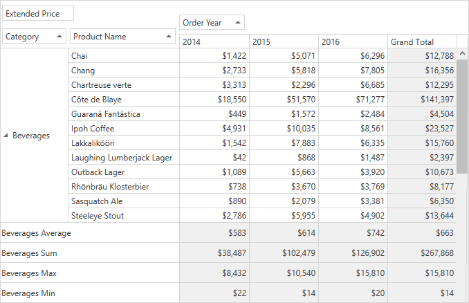

<!-- default badges list -->

<!-- default badges end -->

# Pivot Grid for WPF - Add Custom Totals

The following example demonstrates how to add custom totals for a particular Pivot Grid field:

## Examle Overview

In this example, four different totals are added for the _Category Name_ row field: Average, Sum, Min, and Max. For this, add the `PivotGridCustomTotal` objects to the [PivotGridField.CustomTotals](https://docs.devexpress.com/WPF/DevExpress.Xpf.PivotGrid.PivotGridField.CustomTotals?p=netframework) collection and set the [PivotGridField.TotalsVisibility](https://docs.devexpress.com/WPF/DevExpress.Xpf.PivotGrid.PivotGridField.TotalsVisibility?p=netframework) property to `FieldTotalsVisibility.CustomTotals`.

## Files to Review

* [MainWindow.xaml](./CS/HowToAddCustomTotals/MainWindow.xaml) (VB: [MainWindow.xaml](./VB/HowToAddCustomTotals/MainWindow.xaml))
* [MainWindow.xaml.cs](./CS/HowToAddCustomTotals/MainWindow.xaml.cs) (VB: [MainWindow.xaml.vb](./VB/HowToAddCustomTotals/MainWindow.xaml.vb))

## Documentation

- [Totals](https://docs.devexpress.com/WPF/8057/controls-and-libraries/pivot-grid/data-shaping/aggregation/totals?p=netframework)

<!-- feedback -->
## Does this example address your development requirements/objectives?

 

(you will be redirected to DevExpress.com to submit your response)
<!-- feedback end -->
